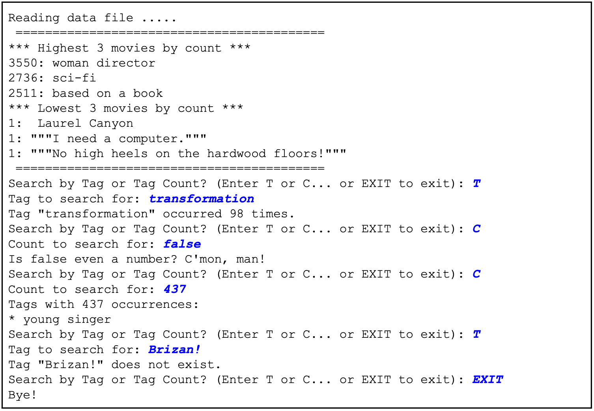

# MovieLens-Efficient-Search

## Overview
The program creates a search for movie tags which entertainment consumers have placed in the MovieLens Dataset. It reads data from a file of tags, allowing the user to search for individual tags by popularity and display the results in a user-friendly manner. The goal is to demonstrate mastery of object oriented design, searching and sorting algorithms by handling a large dataset efficiently with respect to time and space.

## Dataset Details
The tags.csv file is a CSV file with the first row as a header. The first few rows in the tags.csv file appear below. The fields are as follows:
+ userID: the ID of the user who assigned the tag in question
+ movieID: the ID of the movie being tagged
+ tag: The tag assigned
+ timestamp: the date/time when the tag was assigned in Unix time

## Sorting and Searching
Merge sort has been used to achieve efficiency in terms of time complexity. Then, a search algorithm pulls out the required information.

  

